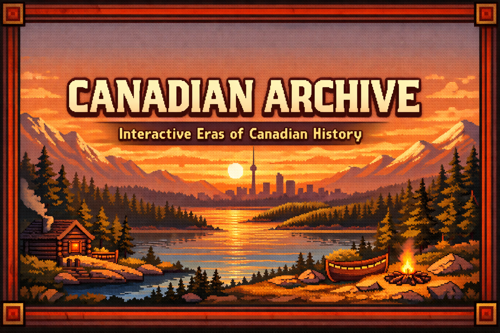

# Canadian Archive

Interactive Canadian history experience built with **Next.js + PixiJS**.

## Quick Links

- [Overview](#overview)
- [Tech Stack](#tech-stack)
- [Getting Started](#getting-started)
- [Environment Setup](#environment-setup)
- [Project Structure](#project-structure)
- [Routes](#routes)
- [Assets](#assets)
- [Team](#team)

## Overview

Canadian Archive combines:

- A pixel-art inspired homepage with clickable era cards
- Interactive era gameplay screens (`/era/[eraId]`)
- A lightweight Gemini chat endpoint for in-era Q&A

## Tech Stack

- Next.js 16 (App Router)
- React 19
- PixiJS + `@pixi/react`
- Tailwind CSS v4
- Google GenAI SDK (`@google/genai`)

## Getting Started

### 1. Install dependencies

```bash
npm install
```

### 2. Set local environment variables

Create `.env.local` in the project root:

```env
GEMINI_API_KEY=your_api_key_here
```

### 3. Start dev server

```bash
npm run dev
```

Then open: `http://localhost:3000`

## Environment Setup

`.env.local` is for local secrets and machine-specific config.

- Required key: `GEMINI_API_KEY`
- Used by: `src/app/api/chat/route.js`
- Do not commit this file to git

## Scripts

- `npm run dev` - Start local development server
- `npm run build` - Build production bundle
- `npm run start` - Run production server
- `npm run lint` - Run ESLint

## Project Structure

```text
src/
  app/
    page.js                 # Homepage (cards, theme, footer links)
    era/[eraId]/page.js     # Era route; mounts GameRoot + EraChatbot
    api/chat/route.js       # Gemini chat endpoint
    globals.css             # Global styles
  game/
    GameRoot.js
    scenes/EraScene.js
    systems/useKeyboard.js
    data/eras.js
    data/events.js
  ui/
    HUD.js
    NodeInfoCard.js
    OpenEventModal.js
    EraChatbot.js

public/
  bg/                       # Era gameplay backgrounds
  home/                     # Homepage visual assets
  sprites/                  # Character/era sprites
  eras_*_images/            # Era content image sets
  readme/                   # README visual assets
```

## Routes

- `/` - Homepage (era selection)
- `/era/era1` ... `/era/era6` - Interactive era screens
- `/api/chat` - Chat API (`POST { "message": "..." }`)

## Assets

Current homepage expects:

- `public/home/homepage_bg1.png`
- `public/home/maple-leaf.png`
- `public/home/cards/era1.png` ... `public/home/cards/era6.png`

README visual asset:

- `public/readme/readme-banner.svg`

## Team

Homepage footer links currently include:

- Andrew
- Sagesse
- Namys
- Chris
- Cellou

LinkedIn links are configured in `src/app/page.js` under `DEVELOPERS`.

## Contribution Notes

- Keep homepage updates scoped to `src/app/page.js` and `public/home/*`
- Keep gameplay updates scoped to `src/game/*` and `src/ui/*`
- Keep API changes scoped to `src/app/api/*`
